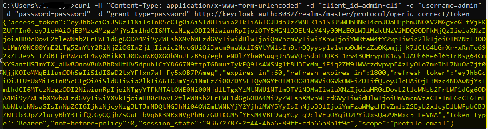

# How to Install Keycloak with Nginx Using Docker Compose
```
cd keycloak-auth
docker compose up -d

After 
[+] Running 3/3 
 ✔ Container postgres-db      Running           
 ✔ Container nginx-server     Started
 ✔ Container keycloak-server  Started
```
- Open Keacloak using url - http://keycloak-auth:8082/  
    NOTE: (Add this host name into your host file)
- Use admin credentials and login to keycloak admin console
- Create realm testing for your work

## Testing Keycloak endpoint

- Open cmd and run following command

```
curl -H "Content-Type: application/x-www-form-urlencoded" -d "client_id=admin-cli" -d "username=admin" -d "password=password" -d "grant_type=password" http://keycloak-auth:8082/realms/master/protocol/openid-connect/token
```
